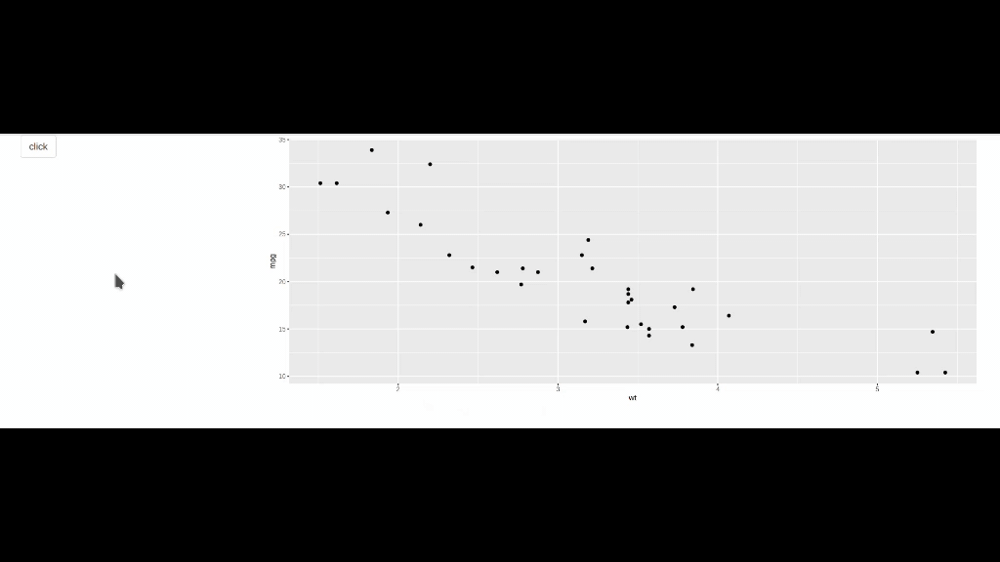

# prompter

<!-- badges: start -->
[](https://codecov.io/github/etiennebacher/prompter)
[](https://github.com/etiennebacher/prompter/actions)
<!-- badges: end -->

The goal of `{prompter}` is to easily create tooltips on many HTML elements in Shiny apps.


## Installation

For now, you can only install the development version:
``` r
# install.packages("devtools")
devtools::install_github("etiennebacher/prompter")
```


## Demo

``` r
library(prompter)
library(shiny)
library(ggplot2)

ui <- fluidPage(

  # Load the dependencies
  use_prompt(),
  
  column(
    3, 
    # Put the element inside add_prompt()...
    add_prompt(
      actionButton("plot", "click"), 
      position = "bottom", message = "this is a button"
    )
  ),
  column(
    9,
    # ... or use magrittr's pipe
    plotOutput("plot") %>% 
       add_prompt(
         message = "this is a plot, and I add some text to show the size of the box",
         position = "left", type = "error", 
         size = "medium", rounded = TRUE
       )
  )
)

server <- function(input, output, session) {
  
  output$plot <- renderPlot(ggplot(mtcars, aes(wt, mpg))+ geom_point())
  
}

shinyApp(ui, server)
```
Here's the output of this code:



## Code of Conduct

Please note that the prompter project is released with a [Contributor Code of Conduct](https://contributor-covenant.org/version/2/0/CODE_OF_CONDUCT.html). By contributing to this project, you agree to abide by its terms.
